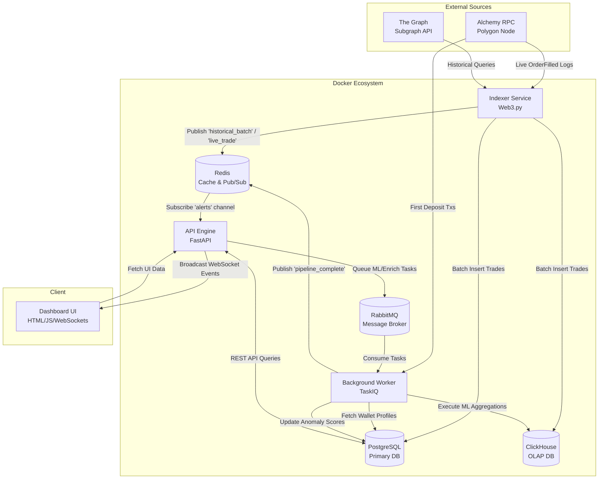

# Polymarket Insider Trading Detector

A highly technical, real-time surveillance engine designed to detect insider trading and anomalous wallet behavior on Polymarket prediction markets. It combines deterministic rule-based analysis with Machine Learning (Isolation Forest) to surface highly suspicious wallets, presenting the intelligence in a real-time, responsive dashboard.

## Table of Contents
1. [Tech Stack](#tech-stack)
2. [System Architecture Diagram](#system-architecture-diagram)
3. [Service Breakdown](#service-breakdown)
4. [Data Flow Blueprint](#data-flow-blueprint)
5. [WebSocket Subsystem](#websocket-subsystem)
6. [API Documentation](#api-documentation)
7. [Installation & Getting Started](#installation--getting-started)

---

## Tech Stack
- **Backend**: Python 3.12, FastAPI, TaskIQ, Web3.py, asyncpg, aiohttp
- **Frontend**: HTML5, Vanilla JavaScript, CSS3, Chart.js
- **Databases**: PostgreSQL 16 (Relational/Transactional), ClickHouse (OLAP), Redis (Pub/Sub & Cache)
- **Infrastructure**: Docker Compose, RabbitMQ (Message Broker)

---

## System Architecture Diagram



---

## Service Breakdown

### 1. API Engine (FastAPI)
The primary interface for client applications, running via Uvicorn on an ASGI server.
- **Responsibilities**: Serves the static assets (HTML/JS/CSS), manages RESTful routing for the dashboard, and handles lifecycle events. 
- **Connection Management**: Instantiates the global connection pool for Postgres (`asyncpg`) and maintains an active `asyncio.Task` listening to the Redis Pub/Sub channel. When messages arrive, they are instantly fanned out to all connected `WebSocket` clients.

### 2. Indexer Service
A continuously running Python process tasked with blockchain synchronization.
- **Backfill Phase**: Uses `aiohttp` to query The Graph's Polymarket subgraph, paginating through historical `OrderFilled` events using timestamp cursors. Trades are mapped into Postgres/ClickHouse schemas.
- **Live Phase**: Connects to Alchemy via `Web3.py` with PoA middleware injected. It uses `eth_getLogs` to poll blocks for the specific `OrderFilled` signature hash. 
- **Performance**: To prevent DB locks and connection exhaustion, the indexer groups transactions and executes bulk inserts using `executemany` against connection pools.

### 3. Background Worker (TaskIQ)
An asynchronous worker process mapped to consume queues from RabbitMQ.
- **Wallet Enrichment**: Calls Polygon RPCs to fetch the very first transaction hash for a wallet, establishing wallet creation age.
- **Machine Learning**: Uses `scikit-learn`'s `IsolationForest`. Instead of querying millions of rows from Postgres, it routes aggregation queries (`sum`, `count`, `max`) to **ClickHouse**, which calculates the multi-dimensional feature matrix in milliseconds. It then trains the model and flags statistical outliers.
- **Deterministic Rules Engine**: Calculates an `insider_score` via hardcoded risk heuristics (e.g., trade concentration >90%, entry timing <2 hours to resolution).

### 4. PostgreSQL 16
The source of truth for application state and relationships.
- **Schema**: Houses the `wallets` table (containing all risk scores and timestamps), the `markets` table (resolutions and questions), and the transactional `trades` table.
- **Concurrency**: Specifically tuned with connection pooling (`DB_POOL_MIN`, `DB_POOL_MAX`) to handle massive concurrent `INSERT ON CONFLICT DO NOTHING` statements from the Indexer without blocking API reads.

### 5. ClickHouse
A columnar database heavily optimized for OLAP workloads.
- **Function**: Replicates the `trades` table structure. Designed exclusively for the ML Worker to perform blazing-fast analytical queries over the entire history of trades, circumventing the traditional index bottlenecks of B-Tree relational databases.

### 6. Redis
- **Volatile Storage**: Used for temporary API request caching (e.g., global stats) to prevent database hammering during traffic spikes.
- **Pub/Sub**: The backbone of the real-time alerting system. The isolated Docker containers (`Indexer`, `Worker`) use Redis `PUBLISH` to send events (like trade insertions or pipeline completions), which the API engine `SUBSCRIBE`s to.

### 7. RabbitMQ
- **Message Broker**: Serves as the durable queue holding serialized background tasks created by the API. Ensures tasks like `run_full_pipeline` or `score_all_wallets` are robustly distributed to the TaskIQ worker and guarantees delivery even if a container restarts.

---

## Data Flow Blueprint

1. **Ingestion Loop**: 
   - The `Indexer` service queries The Graph for past trades and Alchemy's RPC for live `OrderFilled` events.
   - It parses raw blockchain hex data and ABI arguments into human-readable structures (e.g., converting token amounts based on decimals to standard USDC formats).
   - Cleaned trade records are batch-inserted into both **PostgreSQL** and **ClickHouse** simultaneously.
   
2. **Event Broadcasting**:
   - Following a successful batch insertion, the Indexer publishes a `historical_batch` or `live_trade` event to **Redis Pub/Sub**.
   - The FastAPI Engine listens to this channel, parses the JSON payload, and forwards it to active **WebSocket** clients. The Dashboard UI intercepts this message and forces a selective re-fetch of trade data to maintain real-time parity.

3. **Wallet Profiling (Enrichment)**:
   - When new wallets are detected, the API enqueues a task to RabbitMQ. The `Worker` consumes it, queries Polygon for the wallet's first inbound transaction, and updates the `first_deposit_at` column in Postgres.

4. **Threat Detection Cycle**:
   - The ML worker queries ClickHouse to extract aggregated wallet behaviors (total trades, market diversification, maximum single-trade exposure). It trains an `IsolationForest` model to detect outliers and assigns an `anomaly_score` to Postgres.
   - Concurrently, the rule-based engine assigns an `insider_score` based on deterministic vectors (e.g., entering maximum capital strictly 2 hours before a market resolves).
   - A unified `global_score` is computed (60% Rules, 40% ML) and saved to Postgres. 

5. **Actionable Intelligence**:
   - The frontend consumes these scores via the `/api/flagged` REST endpoint to visualize a ranked, paginated list of suspicious wallets, continuously re-hydrated by WebSocket prompts.

---

## WebSocket Subsystem

The application leverages WebSockets to achieve zero-latency UI updates, negating the need for aggressive, resource-intensive HTTP polling.

- **Cross-Container Pub/Sub**: Because FastAPI operates in an isolated Docker container, background services like the `Indexer` cannot directly push to the API's WebSocket connections. To bridge this, all services serialize events to JSON and publish them to a Redis channel named `alerts`.
- **Async Fan-out**: A dedicated background loop inside FastAPI's startup lifecycle (`asyncio.create_task`) continuously listens to the Redis channel. When a message is detected, it pushes it to an in-memory `set` containing all currently active `WebSocket` client connections.
- **Client Cache Invalidation**: The dashboard connects to `ws://{HOST}/ws/alerts`. Upon receiving a `live_trade` or `pipeline_complete` socket message, the UI selectively invalidates its HTML DOM state and queries the API for fresh datasets.

---

## API Documentation

### GET Endpoints

#### 1. Retrieve Flagged Wallets
**Endpoint**: `GET /api/flagged`
**Description**: Fetches a paginated, sorted list of wallets that meet the minimum risk thresholds.
**Parameters**:
- `page` (int, default=1): Page index.
- `per_page` (int, default=25): Constraints results per page (max 100).
- `sort_by` (str, default=global_score): Column to rank by (`global_score`, `insider_score`, `anomaly_score`).
- `search` (str, optional): Wallet address `ILIKE` substring filter.

**Expected Output**:
```json
{
  "total": 150,
  "page": 1,
  "per_page": 25,
  "pages": 6,
  "wallets": [
    {
      "address": "0x123abc...",
      "insider_score": 0.85,
      "anomaly_score": 0.91,
      "global_score": 0.88,
      "flagged": true,
      "first_deposit_at": "2023-10-14T08:30:00",
      "scored_at": "2023-11-01T12:00:00"
    }
  ]
}
```

#### 2. Retrieve Wallet Deep Dive
**Endpoint**: `GET /api/wallets/{address}`
**Description**: Fetches granular diagnostic details, the chronological trade ledger, and the exact scoring breakdown factors for a specific wallet.

**Expected Output**:
```json
{
  "address": "0x123abc...",
  "global_score": 0.88,
  "verdict": "High-risk anomaly. Extreme concentration prior to resolution.",
  "breakdown": {
    "entry_timing": 1.0,
    "trade_concentration": 0.8,
    "trade_size": 0.7,
    "wallet_age": 1.0,
    "market_count": 1.0
  },
  "trade_count": 4,
  "max_trade_usdc": 25000.50,
  "trades": [
    {
      "tx_hash": "0xabc123...",
      "condition_id": "0x567def...",
      "usdc_amount": 25000.50,
      "price": 0.99,
      "traded_at": "2023-10-31T23:55:00"
    }
  ]
}
```

#### 3. Retrieve Feed Data
**Endpoint**: `GET /api/trades/historical` & `GET /api/trades/live`
**Description**: Fetches the most recently detected on-chain trades, segregated by their ingestion source. Historical sources from block 0 (The Graph), while Live sources from active blocks (Alchemy RPC).
**Parameters**:
- `limit` (int, default=50): Max records to retrieve.

**Expected Output**:
```json
[
  {
    "tx_hash": "0xdef456...",
    "maker": "0x123abc...",
    "taker": "0x987zyx...",
    "usdc_amount": 1500.00,
    "price": 0.55,
    "traded_at": "2023-11-01T12:05:00"
  }
]
```

#### 4. Diagnostic Health Checks
**Endpoint**: `GET /api/admin/health-check`
**Description**: Triggers a live TCP/HTTP ping across all internal distributed systems (Postgres, Redis, ClickHouse, RabbitMQ) and external APIs (Alchemy, The Graph). Used by the dashboard to power the "Systems Check" modal.

**Expected Output**:
```json
{
  "postgres": { "status": "ok", "message": "Connected" },
  "redis": { "status": "ok", "message": "Connected" },
  "clickhouse": { "status": "ok", "message": "Connected" },
  "rabbitmq": { "status": "ok", "message": "Broker Active" },
  "alchemy": { "status": "ok", "message": "Block: 56789123" },
  "the_graph": { "status": "ok", "message": "Subgraph Responsive" }
}
```

### POST Endpoints (Admin Triggers)

#### 1. Trigger Full Synchronization Pipeline
**Endpoint**: `POST /api/admin/sync`
**Description**: Flushes the Redis cache and pushes a master orchestration task to RabbitMQ, prompting the TaskIQ worker to execute `run_full_pipeline()`.
**Expected Output**: `{"status": "queued"}`

#### 2. Toggle Live Polling Pause State
**Endpoint**: `POST /api/admin/toggle-pause`
**Description**: Mutates a Redis key (`app_paused`) and broadcasts a WebSocket alert. The `Indexer` checks this key during its loop; if `true`, it sleeps and bypasses RPC calls, effectively halting ingestion without stopping the container.
**Expected Output**: `{"paused": true}`

#### 3. Nuclear Reset
**Endpoint**: `POST /api/admin/reset`
**Description**: Executes `TRUNCATE TABLE` on all PostgreSQL tables (trades, wallets, markets, indexer_state), `TRUNCATE`s the ClickHouse analytical trades table, and performs `FLUSHALL` on Redis. Broadcasts a `system_reset` websocket event. Used to completely wipe the surveillance slate clean.
**Expected Output**: `{"status": "success", "message": "System wiped successfully."}`

---

## Installation & Getting Started

### Prerequisites
- Docker and Docker Compose
- Alchemy API Key (Polygon Mainnet)
- The Graph API Key

### Installation
1. Clone the repository and navigate into the directory.
2. Configure your `.env` file with your API keys:
   ```env
   ALCHEMY_RPC_URL=https://polygon-mainnet.g.alchemy.com/v2/YOUR_KEY
   SUBGRAPH_URL=https://gateway.thegraph.com/api/YOUR_KEY/...
   ```
3. Start the system:
   ```bash
   docker compose up -d --build
   ```
4. Access the dashboard at `http://localhost:8000`.
